# Inferia Vision Runtime

Inferia Vision Runtime (IVR) is an experiment in treating object detection not as a single fixed pipeline but as a sequence of decisions. Most vision systems pick one model, one input resolution and one numerical precision at deployment time and then run that exact configuration on every single frame for the lifetime of the system, whether the scene in front of the camera is an empty parking lot or a packed intersection. That choice is almost always wasteful in one direction or the other. A model sized for the worst case burns compute and battery on easy frames, and a model sized for the easy case falls apart the moment the scene gets crowded. IVR trains a reinforcement learning agent to make that choice itself, frame by frame, based on what it currently sees and what the underlying hardware can currently afford.

The agent sits between the camera and the detector. Every frame it looks at a small set of cheap signals (how much motion is in the scene, how many objects were seen a moment ago, how bright the image is, how loaded the hardware currently is) and picks one of eighteen possible runtime configurations: a model size, an input resolution and a numerical precision. That configuration is then used to run the actual detector on the frame, and the resulting detection quality, latency and resource cost are folded into a reward signal that trains the agent to make better choices over time. The goal is not to build a better detector. YOLO11 already exists and works fine. The goal is to build the layer that decides, moment to moment, which version of YOLO11 is worth running right now.

## Why this is a real problem and not a toy one

Anyone deploying vision models on constrained hardware, a Raspberry Pi class board, a drone, a body camera, a warehouse robot, runs into the same wall almost immediately. The device does not have the headroom to always run the most accurate model, but it also cannot afford to always run the cheapest one, because a scene can go from empty to crowded within a couple of seconds and a system that is not watching for that will simply miss things. Engineers usually solve this with hand written heuristics: if the object count crosses some threshold, switch to a bigger model, if the battery drops below some percentage, switch to a smaller one. Those heuristics work until the environment changes slightly and the fixed thresholds stop making sense. IVR replaces the heuristic with a learned policy that discovers the trade off on its own, from reward, rather than from a rule someone wrote down in advance.

This repository is the implementation of that idea end to end: the environment the agent trains in, the reward functions it optimizes, the hardware model it is constrained by, and the evaluation harness that checks whether any of this actually produced something better than just picking one fixed configuration and leaving it alone.

## Architecture

The system is organized as a loop. A frame source hands a frame to a scene analyzer, which extracts cheap features without running the detector. Those features, combined with the hardware's current state, become the observation the agent sees. The agent picks an action, which is decoded into a concrete model, resolution and precision. That configuration is used to actually run the detector on the frame. The detector's output, together with the true cost of running that configuration, is turned into a reward. The agent updates on that reward and the loop continues on the next frame.

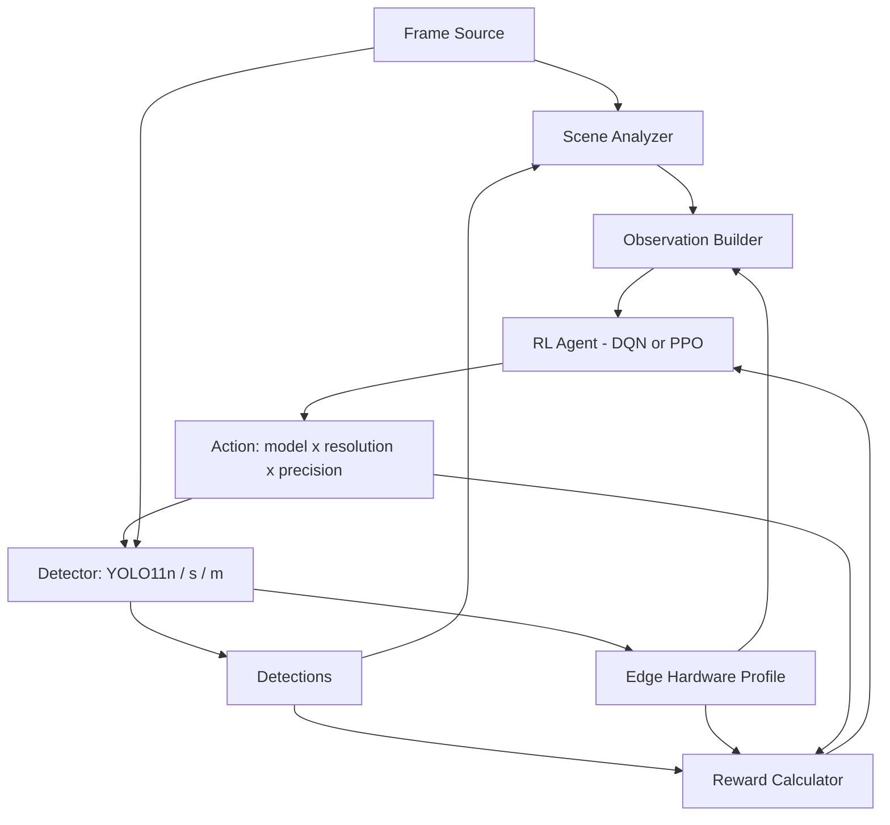

The hardware profile is worth calling out on its own, because it is the piece that makes the whole exercise meaningful rather than academic. Training happens on a desktop GPU with far more memory and power headroom than any real edge device, so if the agent were allowed to observe and be rewarded against the training GPU's actual behaviour, it would simply learn that every configuration is free and default to the most expensive one every time. This is exactly what happened in early versions of this project. Instead, IVR simulates the resource profile of a Rockchip RK3588S2 board (the target deployment hardware), estimating VRAM use, NPU utilisation, power draw and temperature for each of the eighteen possible configurations, and it is this simulated profile, not the real training GPU, that the agent observes and is constrained by. The separation between physical specification, simulated parameters and policy budget is kept explicit in the code specifically so that swapping in real measured numbers later, once actual hardware is benchmarked, is a configuration change rather than a rewrite.

## The state and action spaces

The agent's observation is a fourteen dimensional vector, normalised to the zero to one range, updated every frame before the detector even runs on that frame. The first ten dimensions come from the scene analyzer and are cheap by design: motion magnitude between consecutive frames, the object count from the previous frame, mean detection confidence, mean bounding box area, image brightness, image entropy, a temporal consistency score computed from box overlap across frames, current measured frames per second, the latency of the last inference call and the index of the action taken last time. The remaining four dimensions come from the simulated hardware profile for whatever configuration is currently active: NPU utilisation, memory used against the inference budget, temperature and power draw. The idea is that the agent should be able to answer two separate questions from its observation alone, how complex is the scene right now, and how much room does the hardware currently have to spend.

| Dimension | Signal | Source |
|---|---|---|
| 0 | Motion magnitude | Scene analyzer |
| 1 | Object count (normalised) | Scene analyzer |
| 2 | Mean detection confidence | Scene analyzer |
| 3 | Mean bounding box area | Scene analyzer |
| 4 | Brightness | Scene analyzer |
| 5 | Image entropy | Scene analyzer |
| 6 | Temporal consistency (IoU across frames) | Scene analyzer |
| 7 | Current FPS | Telemetry |
| 8 | Last inference latency | Telemetry |
| 9 | Last action taken | Agent history |
| 10 | Simulated NPU utilisation | Edge hardware profile |
| 11 | Simulated memory pressure | Edge hardware profile |
| 12 | Simulated temperature | Edge hardware profile |
| 13 | Simulated power draw | Edge hardware profile |

The action space is the Cartesian product of three model sizes (YOLO11 nano, small and medium), three input resolutions (480, 640 and 960 pixels) and two numerical precisions (fp32 and fp16), giving eighteen discrete actions in total. This is deliberately a flat discrete space rather than three separate continuous or hierarchical choices, mostly because it keeps the problem approachable for off the shelf algorithms like DQN and PPO without needing custom multi head architectures, at the cost of the action space growing multiplicatively if more dimensions were added later.

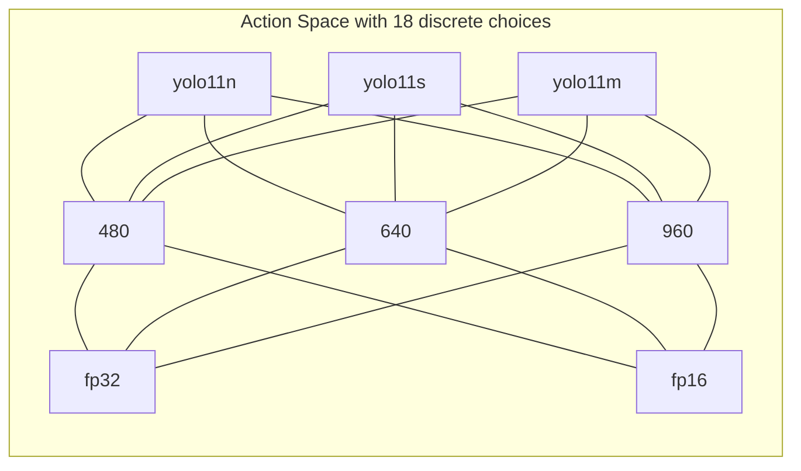

## Reward, and the difference between guessing quality and measuring it

The reward computed on every step balances four competing terms: detection quality, inference latency, compute cost and a penalty for switching configuration too often, on top of a hard penalty if the chosen configuration would exceed the simulated hardware's power, memory, temperature or latency budget.

```
reward = w_quality * (0.7 * quality + 0.3 * stability)
       - w_latency * min(1, latency / max_latency)
       - w_compute * compute_cost(action)
       - w_switch * (1 if action changed else 0)
       - constraint_penalty
```

The switching penalty exists because a policy that flickers between a cheap and an expensive model every other frame is not actually useful even if it scores well on paper, real deployments pay a real cost for reconfiguring a model, loading different weights and re-warming caches, so the reward has to reflect that. The constraint penalty is proportional to how far a configuration would exceed the simulated hardware's budget, not a hard mask on which actions are legal, which keeps the underlying DQN and PPO implementations completely unmodified.

The quality term is the part of this project that changed the most, and it is worth explaining honestly why. The first dataset used for training was BDD-A, a large set of real dashcam driving footage. BDD-A is genuinely useful footage but it was collected for a driver attention study, which means it comes with gaze heatmaps rather than object detection labels. There is no ground truth to compare a detector's output against. Early training used a proxy for quality instead, mean detection confidence multiplied by object count relative to a target count, on the reasoning that a detector which is confident and finds a reasonable number of objects is probably doing well. That proxy is a guess, not a measurement, and it eventually became the ceiling on what the whole system could learn, because a policy can only be as good as the signal it is trained against.

UA-DETRAC is a different kind of dataset: one hundred sequences of real traffic camera footage with every vehicle in every frame hand annotated with a bounding box. Once ground truth boxes exist, quality can be computed properly rather than guessed at. IVR's real reward backend matches each predicted box against the closest ground truth box by intersection over union at a threshold of 0.5, and from that greedy matching computes precision, recall and their harmonic mean, the F1 score, per frame. This is a deliberate simplification relative to a full COCO style mean average precision protocol (one IoU threshold rather than several, no confidence sweep, class agnostic matching) chosen because it is fast enough to run inside the training loop on every single step, but it is a real measurement against real labels, which the proxy never was.

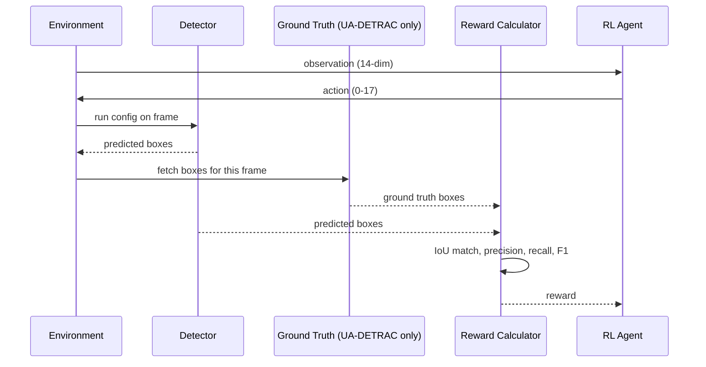

Every episode is a randomly sampled chunk of 150 to 300 frames from a randomly chosen video or sequence, reset with a fixed seed for reproducibility, and there is a deliberate one frame lag between choosing a configuration and it being applied, since a real streaming system cannot act on a frame before it has finished being decided about. Both DQN and PPO, via Stable-Baselines3, are trained on identical environments so their results are directly comparable rather than trained under subtly different conditions.

## Two datasets, two very different scenes

BDD-A is dashcam footage from a moving vehicle, mostly city driving, and its object density (measured as mean detections per frame using a fixed nano model as a reference so the measurement does not depend on which policy is being evaluated) sits mostly in the sparse to mid range. UA-DETRAC is a fixed traffic camera looking down at a multi lane road, and it is noticeably denser on average. The distribution below, computed over every held out video in both datasets, shows why this matters: a dataset with little density variation gives an adaptive policy little reason to ever change its behaviour, because there is no real trade off between model size and detection quality to discover.

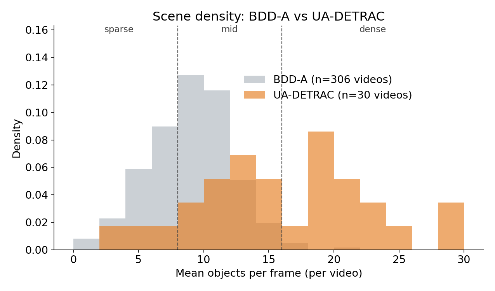

The two datasets also look different in a more literal sense. Below are real frames sampled from each, at low, medium and high object density, showing what the agent actually has to work with. The BDD-A frames are annotated with our own detector's output, since no ground truth boxes exist for this dataset. The UA-DETRAC frames are annotated with the real, human labeled ground truth.

<table>
<tr>
<td>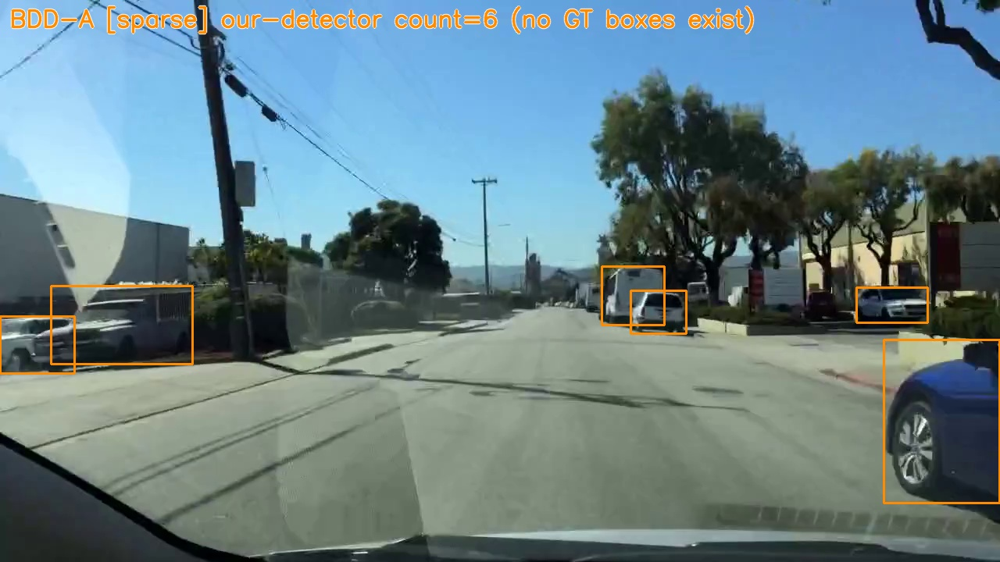</td>
<td>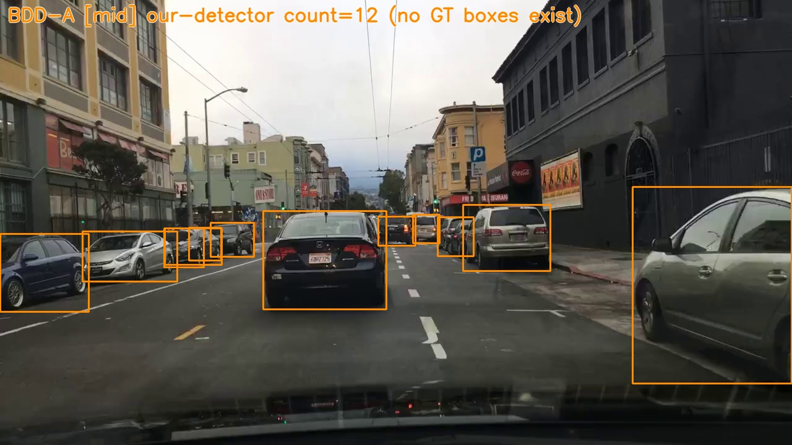</td>
<td>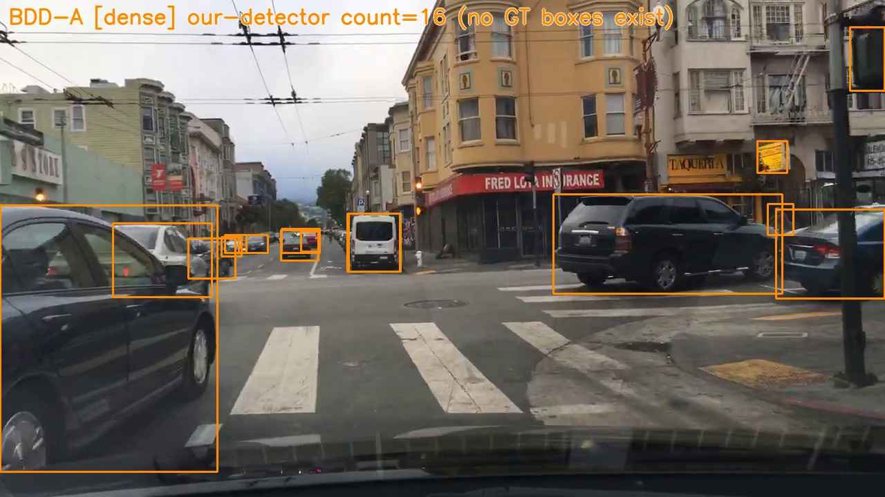</td>
</tr>
<tr>
<td>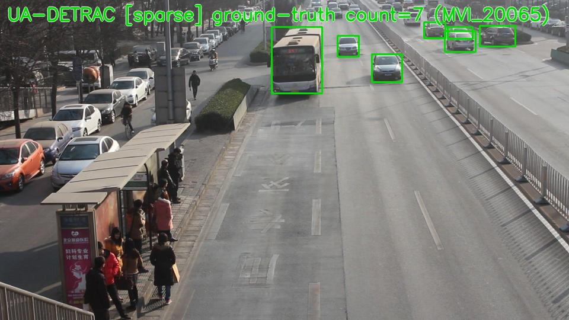</td>
<td>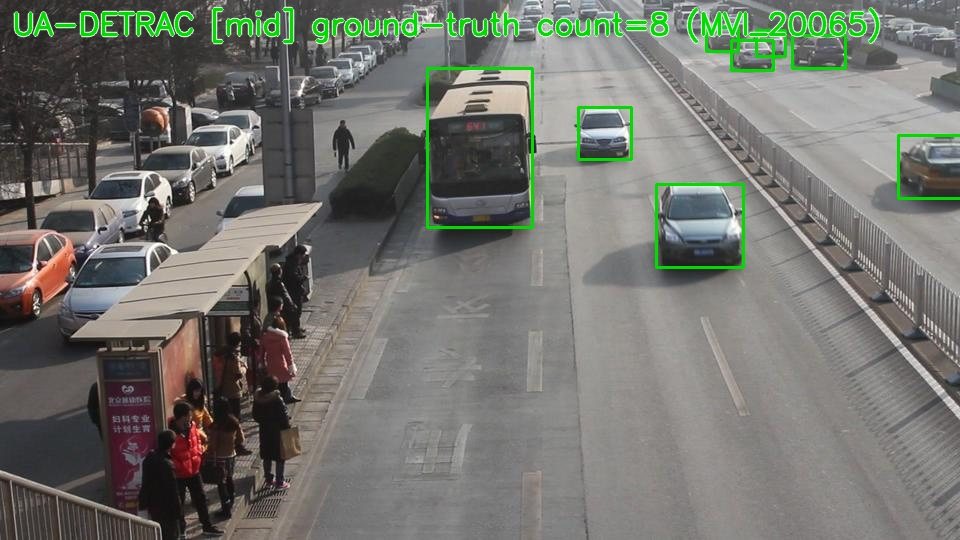</td>
<td>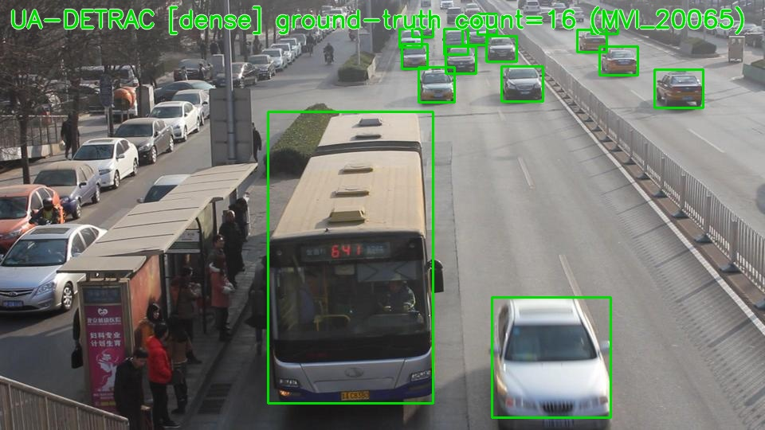</td>
</tr>
</table>

## Does it actually work: results on UA-DETRAC

This is the part that matters most, so it is worth being precise rather than promotional about it. DQN was trained for 120,000 steps and PPO for 300,000 steps, both from scratch, on the sixty UA-DETRAC training sequences using the real IoU matched reward described above, then evaluated on thirty held out test sequences against six baselines: three fixed configurations (always nano, always small, always medium), a random policy, a simple object count threshold rule, and a contextual bandit.

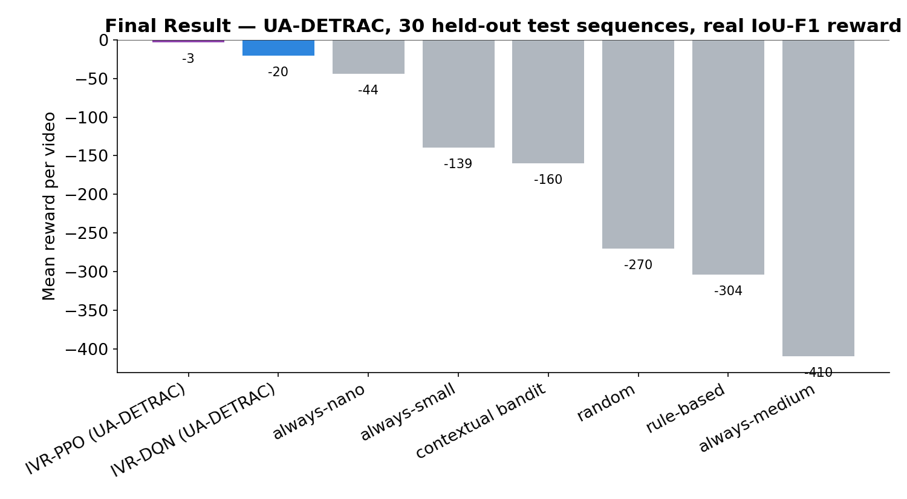

| Policy | Mean reward | Std dev | Latency (ms) | FPS | Mean count | Switches per video |
|---|---|---|---|---|---|---|
| IVR PPO | -3.2 | 14.2 | 6.1 | 163.6 | 12.4 | 1.0 |
| IVR DQN | -20.4 | 19.0 | 11.6 | 90.1 | 13.8 | 3.3 |
| Always nano | -43.8 | 12.2 | 18.0 | 55.8 | 16.7 | 1.0 |
| Always small | -139.5 | 8.1 | 45.0 | 22.4 | 19.4 | 1.0 |
| Contextual bandit | -160.1 | 74.1 | 36.4 | 45.1 | 17.2 | 224.0 |
| Random | -270.2 | 8.1 | 68.2 | 15.7 | 18.9 | 263.0 |
| Rule based | -303.7 | 137.5 | 89.8 | 16.1 | 18.2 | 21.4 |
| Always medium | -409.7 | 6.2 | 120.0 | 8.4 | 18.6 | 1.0 |

Both trained policies beat every fixed configuration and every non learning baseline by a wide margin, with paired t tests against every baseline coming back at p below 1e-11. That is the headline result, and it is the first point in this project's history where the trained policies decisively outperformed simply picking one configuration and never touching it again, rather than only marginally edging it out.

Reading the table a little more carefully tells a more interesting story than "PPO wins". PPO's policy converged onto a single fixed configuration, YOLO11 nano at 480 pixels with fp16 precision, and stayed there for the entire evaluation, essentially zero real switches. It found the cheapest possible option and it happened to also be very close to the best option, because on UA-DETRAC's traffic camera footage the larger models do not detect meaningfully better than nano does, so there was no real accuracy for cost trade off left for PPO to exploit by adapting. DQN, in contrast, kept switching, toggling its resolution choice between 480 and 640 pixels depending on scene content, ninety eight switches across the thirty evaluation videos, and paid a small reward cost for that willingness to adapt. PPO is the better number. DQN is the better demonstration of the actual thing this project is trying to prove works.

The clearest evidence that DQN's adaptivity is real and not a statistical artifact of the aggregate numbers comes from watching a single held out episode play out frame by frame. The chart below is not a summary statistic, it is the trained DQN policy's literal resolution choice, frame by frame, over one evaluation video, plotted against the actual object count in that video at that moment.

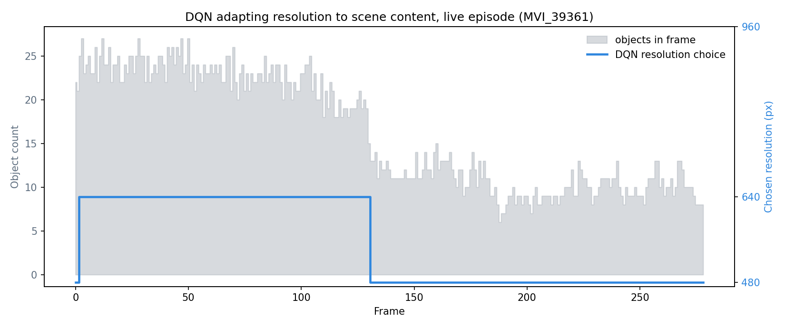

The object count starts high, in the twenties, for roughly the first hundred and thirty frames, and the policy holds at 640 pixels for exactly that stretch. The moment the object count drops into the low teens, the policy drops to 480 pixels and stays there. Nobody hand coded that threshold, it emerged from training against reward.

Looking at the latency and reward trade off across every policy at once makes the same point from a different angle. Both trained policies sit clearly above and to the left of every fixed baseline, meaning they get more reward for less latency than anything that was not trained.

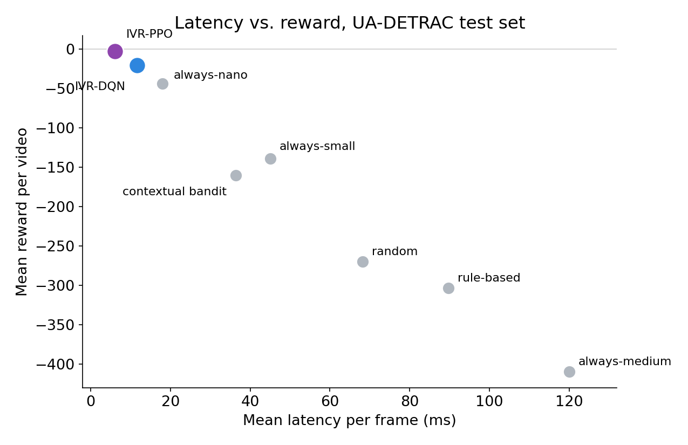

## Repository layout

The codebase is organized as a small set of top level Python packages rather than one large wrapping package, so that the package names declared in `pyproject.toml` match the actual importable module paths and imports stay absolute rather than relying on deep relative paths across package boundaries.

```
configs/
  env/          environment configs: which dataset, which video source, episode length
  reward/       reward weight configs: proxy vs real backend, latency and compute weights
  training/     hyperparameter configs for DQN and PPO
  hardware.yaml simulated edge device profile (Rockchip RK3588S2)
  variants.yaml model pool definition (yolo11n/s/m, GFLOPs, weight file paths)
vision_pipeline/
  yolo_detector.py       thin wrapper around ultralytics YOLO, returns boxes + confidence + latency
  scene_analyzer.py      cheap pre-inference scene features
  video_frame_source.py  video file and multi-video dataset ingestion
  detrac_source.py       UA-DETRAC frame source and XML ground truth parser
reinforcement_learning/
  vision_runtime_env.py     the gymnasium.Env implementing the loop described above
  reward_calculator.py      ProxyReward and MapReward (the real IoU-F1 backend)
  observation_features.py   builds the 14-dim observation vector
  train_runtime.py          unified DQN / PPO training entrypoint
runtime/
  environment_factory.py  wires yaml configs into a fully constructed environment
  edge_profile.py         the simulated Rockchip hardware model and constraint checker
  latency_estimator.py    nominal per-config latency model
  system_telemetry.py     rolling latency / fps / gpu-snapshot bookkeeping
evaluation/
  baseline_schedulers.py  the fixed, random, rule based and bandit baselines
  benchmark_runner.py     runs every policy over a dataset, computes paired statistics
model_management/
  model_variants.py         model pool registry
  runtime_config_space.py   flattens model x resolution x precision into the 18 discrete actions
tooling_scripts/    detached training runner, multi-stage experiment sequencers, offline validation suite
docs/               design notes and the screenshots referenced in this README
train.py, eval.py, sweep.py    root level command line entrypoints
```

## Running it

Training and evaluation both go through the root level launcher scripts, which take yaml config paths rather than long argument lists, so a full run looks like:

```
python train.py --env configs/env/env_detrac.yaml --reward configs/reward/reward_detrac.yaml --training configs/training/training_bdd.yaml --algorithm dqn --timesteps 120000

python eval.py --env configs/env/env_detrac.yaml --reward configs/reward/reward_detrac.yaml --model training/dqn_detrac_final.zip --dataset test
```

Swapping `--env`/`--reward` to the BDD-A configs and pointing `--algorithm` at `ppo` trains and evaluates the same way against the older proxy reward dataset. `tooling_scripts/validate_pipeline.py` runs a thirteen check offline validation suite (constraint behaviour, checkpoint round tripping, observation sanity) that is meant to be run after any change to the environment, reward or hardware model before trusting a long training run to it.

## Honest state of things right now

The real reward pipeline works and both algorithms clearly beat every fixed baseline on it, which is the core claim this project set out to support. What it has not yet shown is an RL policy paying for a bigger model because the scene genuinely demands it on a dataset where that trade off exists in the first place, since UA-DETRAC turned out to be a dataset where the cheapest model is already close to the best one. The natural next step is evaluating on footage with more scene density variation so that model choice, not just resolution, has room to matter, along with recalibrating the reward's latency and compute weights now that quality is measured rather than guessed, and eventually replacing the simulated Rockchip hardware numbers with measurements taken from the real board.
